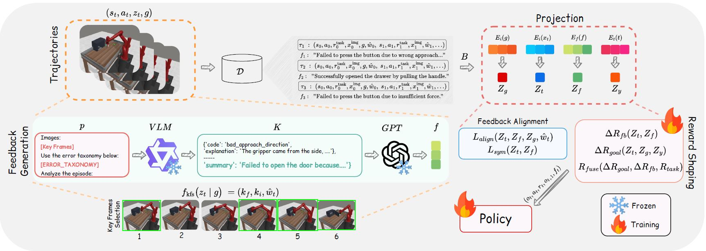

# LaGEA

<div align="center">
  <!-- <h1><b> TimeCMA </b></h1> -->
  <!-- <h2><b> Time-CMA </b></h2> -->
  <h2><b> (ICML'26) (Poster) LaGEA: Language Guided Embodied Agents for Robotic Manipulation </b></h2>
</div>

[](https://arxiv.org/abs/2509.23155)

> If you find our work useful in your research. Please consider giving a star ⭐ and citation 📚:

```bibtex
@article{chowdhury2025lagea,
  title={LAGEA: Language Guided Embodied Agents for Robotic Manipulation},
  author={Chowdhury, Abdul Monaf and Mazumder, Akm Moshiur Rahman and Akter, Rabeya and Arib, Safaeid Hossain},
  journal={arXiv preprint arXiv:2509.23155},
  year={2025}
}
``` 

## Abstract
Robotic manipulation benefits from foundation models that describe goals, but today's agents still lack a principled way to learn from their own mistakes. We ask whether natural language can serve as feedback, an error-reasoning signal that helps embodied agents diagnose what went wrong and correct course. We introduce LAGEA (Language Guided Embodied Agents), a framework that turns episodic, schema-constrained reflections from a vision language model (VLM) into temporally grounded guidance for reinforcement learning. LAGEA summarizes each attempt in concise language, localizes the decisive moments in the trajectory, aligns feedback with visual state in a shared representation, and converts goal progress and feedback agreement into bounded, step-wise shaping rewards whose influence is modulated by an adaptive, failure-aware coefficient. This design yields dense signals early when exploration needs direction and gracefully recedes as competence grows. On the Meta-World MT10 and Robotic Fetch embodied manipulation benchmark, LAGEA improves average success over the state-of-the-art (SOTA) methods by 9.0% on random goals, 5.3% on fixed goals, and 17% on fetch tasks, while converging faster. These results support our hypothesis: language, when structured and grounded in time, is an effective mechanism for teaching robots to self-reflect on mistakes and make better choices. Code is available at: https://github.com/monaf-chowdhury/LaGEA

<p align="center">
  
</p>

---

## Environment Setup

Install the conda env via:

```shell
conda create --name lagea python==3.11
conda activate lagea
pip install -r requirements.txt
pip install transformers==4.51.3 accelerate==1.10.0
pip install qwen-vl-utils[decord]
```
---

## Training

### Generating Expert Dataset

An optional setting in LaGEA is to use a goal image to accelerate the exploration before we collected the first successful trajectory.

```script
python main.py --config.env_name=door-open-v2-goal-hidden --config.exp_name=oracle
```

The oracle trajectory data will be saved in `data/oracle`.

### Example on Fixed-goal Task

```
python main.py --config.env_name=door-open-v2-goal-hidden --config.exp_name=lagea
```

### Example on Random-goal Task

```
python main.py --config.env_name=door-open-v2-goal-observable --config.exp_name=lagea
```

---

## Contact Us
For inquiries or further assistance, contact us at [monafabdul15@gmail.com](mailto:monafabdul15@gmail.com) or open an issue on this repository.
